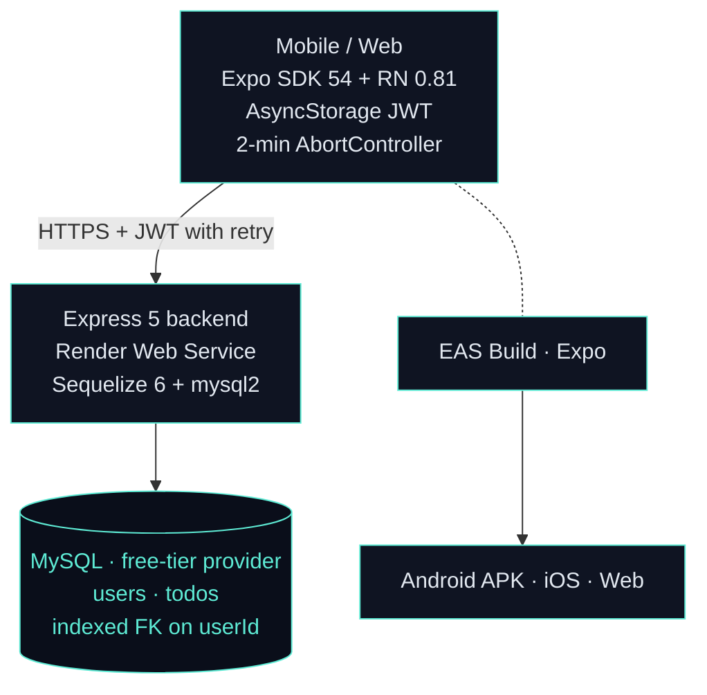
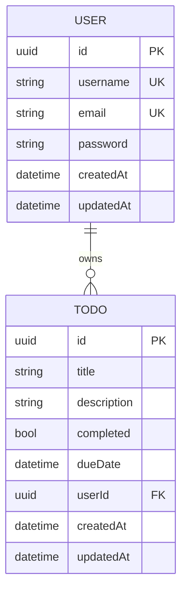
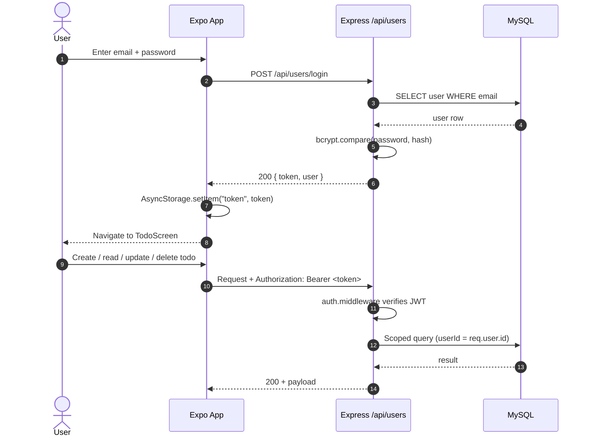
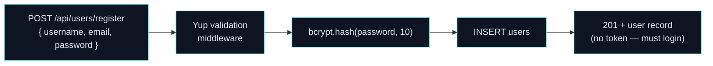

# To-Do List App — Backend

> A multi-user todo REST API — register, sign in, and manage tasks with JWT auth, Sequelize ORM, and MySQL. Paired with an Expo / React Native mobile client distributed as an Android APK.

This is the **Express 5 backend** for the To-Do List App. It exposes a versioned JSON API under `/api`, handles user authentication (JWT + bcrypt), and owns the MySQL schema via Sequelize 6 auto-sync. The companion mobile app lives in [`todo-list-frontend`](https://github.com/Asciente-rks/todo-list-frontend) and talks to this service over HTTPS.

Deployed as a Render Web Service on the free tier — sleeps after 15 minutes of inactivity. The mobile client handles cold starts gracefully with a 2-minute `AbortController` timeout and a visible `WakeUpNotice` banner.

---

## Live Demo

- **Download APK:** https://expo.dev/accounts/asciente-rks/projects/to-do-list-ts-frontend/builds/b3c0fe0b-93d5-4a8d-a56f-7ebd12440418
- **Backend:** Render Web Service (`to-do-list-api`) — `GET /health` returns `{ status: "UP" }`
- **API base:** `https://<render-slug>.onrender.com/api`

> First request after idle may take 30–60 seconds; the mobile app shows a wake-up banner and retries automatically.

---

## Table of Contents

1. [What It Does](#what-it-does)
2. [Architecture](#architecture)
3. [Tech Stack](#tech-stack)
4. [Database Design](#database-design)
5. [Repository Layout](#repository-layout)
6. [API Reference](#api-reference)
7. [Auth Flow](#auth-flow)
8. [Repos](#repos)
9. [Local Development](#local-development)
10. [Cost Breakdown](#cost-breakdown)
11. [Author](#author)

---

## What It Does

- **User registration** — `POST /api/users/register` hashes the password with bcrypt, stores the user, and returns the record.
- **JWT login** — `POST /api/users/login` validates credentials, signs a token, and returns it. The mobile app stores the token in `AsyncStorage` and attaches it as `Authorization: Bearer <token>` on every subsequent request.
- **Auth middleware** — every protected route passes through `auth.middleware.ts` which verifies the token and attaches `req.user`. Unauthenticated requests get `401`.
- **Yup validation middleware** — `validation.middleware.ts` runs a Yup schema check before the controller runs; shape mismatches return `400` with field-level errors.
- **Full CRUD for todos** — create, read all (scoped to the authenticated user), read one, update, and delete. All todo operations are ownership-gated: you can only touch your own tasks.
- **Due dates** — todos carry an optional `dueDate` datetime field; the mobile client exposes a native date picker.
- **Health & wake-up routes** — `GET /` and `GET /api` return `200` immediately so Render's health checks and the mobile app's wake-up probe don't hit a cold-start 502.
- **CORS open to `*`** — required for sideloaded APKs which have no fixed origin header.
- **Sequelize auto-sync** — `sequelize.sync()` on startup ensures the MySQL schema matches the models without a migration runner at this scale.

---

## Architecture



### Notable architectural choices

- **Render free tier for the backend** — sleeps after 15 minutes of inactivity. The mobile app handles this gracefully: 2-minute request timeout (covers cold start) + `WakeUpNotice` banner + retry wrapper. `GET /health` is `no-store` cached to avoid false-positive 200s from a proxy.
- **JWT in AsyncStorage** — works the same on Android, iOS, and web. No platform-specific secure storage needed at this scale.
- **Single-flag auth state in App.tsx** — `isAuthenticated` + `isRegistering` toggle which screen renders. No navigation library keeps the bundle small.
- **Sequelize auto-sync** — `sequelize.sync()` ensures the MySQL schema matches models on every startup. Sufficient for a portfolio-scale app without migration overhead.
- **Repository pattern** — controllers delegate persistence to `*.repository.ts` files; services sit between them. Separation of concerns scales cleanly even without a DI container.
- **Express 5** — async error propagation is built in (rejected promises bubble to the error handler automatically), so `try/catch` wrappers in controllers are optional.

---

## Tech Stack

### Backend

| Layer | Technology | Why |
|-------|-----------|-----|
| Runtime | Node.js + TypeScript 5 | Strong typing end-to-end |
| Framework | **Express 5** | Async error propagation built-in, minimal overhead |
| ORM | **Sequelize 6** + mysql2 | Declarative models, auto-sync, association helpers |
| Database | **MySQL** | Relational, free tiers available (Aiven, Filess.io) |
| Auth | **jsonwebtoken** + **bcrypt** | Industry-standard token + password hashing |
| Validation | **Yup** | Schema-first, same library on frontend and backend |
| Dev tooling | ts-node-dev | Fast TypeScript reloads without tsc compilation step |
| Hosting | **Render Web Service** | Free tier, auto-deploy on push, managed TLS |

### Mobile (companion repo)

| Layer | Technology | Why |
|-------|-----------|-----|
| Framework | Expo SDK 54 + React Native 0.81 | Managed workflow, one codebase for Android + iOS + web |
| Language | TypeScript 5 + React 19 | Consistent with backend |
| Storage | `@react-native-async-storage/async-storage` | Simple persistent token store |
| Date picker | `@react-native-community/datetimepicker` | Native OS date/time UI |
| Icons | lucide-react-native | Consistent icon set |
| HTTP | `fetch` + `AbortController` | No extra deps; handles 2-min cold-start timeout |
| Build | **EAS Build** | Cloud APK/IPA builds, GitHub Releases distribution |

---

## Database Design

Two tables. Both keyed by UUID v4. Simple 1-to-many: one user owns many todos.



### Tables

#### `users`

| Column | Type | Notes |
|--------|------|-------|
| `id` | UUID (PK) | v4, auto-generated |
| `username` | VARCHAR | unique |
| `email` | VARCHAR | unique |
| `password` | VARCHAR | bcrypt hash |
| `createdAt` | DATETIME | Sequelize managed |
| `updatedAt` | DATETIME | Sequelize managed |

#### `todos`

| Column | Type | Notes |
|--------|------|-------|
| `id` | UUID (PK) | v4, auto-generated |
| `title` | VARCHAR | required |
| `description` | VARCHAR | optional |
| `completed` | BOOLEAN | default `false` |
| `dueDate` | DATETIME | nullable |
| `userId` | UUID (FK) | indexed, references `users.id` |
| `createdAt` | DATETIME | Sequelize managed |
| `updatedAt` | DATETIME | Sequelize managed |

**Notable design choices:**
- `userId` FK carries an index — `findAll({ where: { userId } })` is the dominant query pattern; the index keeps it O(log n) as rows grow.
- `sequelize.sync()` without `{ force: true }` — safe to run on every deploy; only adds missing columns, never drops.
- Associations declared in `src/associations/associations.ts` and called before `sync()` so Sequelize resolves the FK constraint order correctly.

---

## Repository Layout

```
todo-list/                         # This repo — Express 5 backend
├── package.json                   # Node.js, Express 5, Sequelize 6, bcrypt, JWT, Yup
├── tsconfig.json
└── src/
    ├── server.ts                  # Entry point: CORS, middleware, route mounting, sync
    ├── associations/
    │   └── associations.ts        # User.hasMany(Todo) + Todo.belongsTo(User)
    ├── controllers/
    │   ├── todo/                  # createTodo · getAllTodos · getTodoById · updateTodo · deleteTodo
    │   └── users/                 # register · login · getUserById · getAllUsers · updateUser · deleteUser
    ├── dtos/
    │   ├── todo/                  # create-todo · update-todo · todo-response shapes
    │   └── users/                 # create-user · login · update-user shapes
    ├── middlewares/
    │   ├── auth.middleware.ts     # JWT verify → req.user
    │   └── validation.middleware.ts # Yup schema check → 400 on mismatch
    ├── models/
    │   ├── todo/todo.sequelize.ts # Sequelize model: fields, UUID defaults, tableName
    │   └── users/user.sequelize.ts
    ├── repositories/
    │   ├── todo/todo.repository.ts   # DB access layer (findAll, findByPk, create, etc.)
    │   └── users/user.repository.ts
    ├── routes/
    │   ├── todo/todo.routes.ts    # /api/todos — auth-gated CRUD
    │   └── users/user.routes.ts   # /api/users — register, login, user management
    ├── services/
    │   ├── todo/todo.service.ts   # Business logic: ownership check, transform
    │   └── users/user.service.ts  # Register, login, bcrypt hash, JWT sign
    └── utils/
        ├── db.ts                  # Sequelize instance + testConnection()
        └── validate-util.ts       # Shared Yup schemas for users and todos
```

---

## API Reference

All endpoints are prefixed `/api`. Protected routes require `Authorization: Bearer <token>`.

### Auth & Users

| Method | Path | Auth | Purpose |
|--------|------|------|---------|
| POST | `/api/users/register` | none | Create account — `{ username, email, password }` → user record |
| POST | `/api/users/login` | none | Sign in — `{ email, password }` → `{ token, user }` |
| GET | `/api/users` | Bearer | List all users (admin utility) |
| GET | `/api/users/:id` | Bearer | Get one user by ID |
| PUT | `/api/users/:id` | Bearer | Update user fields |
| DELETE | `/api/users/:id` | Bearer | Delete user |

### Todos

| Method | Path | Auth | Purpose |
|--------|------|------|---------|
| GET | `/api/todos` | Bearer | List all todos for the authenticated user |
| POST | `/api/todos` | Bearer | Create a todo — `{ title, description?, completed?, dueDate? }` |
| GET | `/api/todos/:id` | Bearer | Get one todo (ownership enforced) |
| PUT | `/api/todos/:id` | Bearer | Update todo fields (ownership enforced) |
| DELETE | `/api/todos/:id` | Bearer | Delete todo (ownership enforced) |

### Health & Status

| Method | Path | Auth | Purpose |
|--------|------|------|---------|
| GET | `/` | none | `"Server is alive"` — wake-up probe target |
| GET | `/api` | none | `{ status: "online", message: "..." }` — API root ping |
| GET | `/health` | none | `{ status: "UP", service, timestamp }` — Render health check, `no-store` |

---

## Auth Flow



### Registration flow



---

## Repos

This project is split across two repositories:

| Repo | Stack | Branch |
|------|-------|--------|
| **[todo-list](https://github.com/Asciente-rks/todo-list)** ← you are here | Express 5 + Sequelize + MySQL + JWT | `master` |
| **[todo-list-frontend](https://github.com/Asciente-rks/todo-list-frontend)** | Expo SDK 54 / React Native — Android, iOS, web | `main` |

The frontend builds to an Android APK via EAS Build and is distributed through GitHub Releases and the Expo build link above.

---

## Local Development

```bash
# 1. Clone and install
git clone https://github.com/Asciente-rks/todo-list.git
cd todo-list
npm install

# 2. Environment variables — create a .env file
DB_HOST=localhost
DB_PORT=3306
DB_NAME=todolist
DB_USER=root
DB_PASSWORD=yourpassword
JWT_SECRET=your-secret-key
PORT=10000

# 3. Start the dev server (ts-node-dev, hot reload)
npm run dev

# 4. Type-check only
npx tsc --noEmit

# 5. Build for production
npm run build   # tsc → dist/
npm start       # node dist/server.js
```

The server will connect to MySQL, run `sequelize.sync()`, and listen on `PORT` (default `10000`). Confirm with:

```bash
curl http://localhost:10000/health
# { "status": "UP", "service": "to-do-list-api", "timestamp": "..." }
```

### Environment Variables

| Variable | Default | Required | Notes |
|----------|---------|----------|-------|
| `DB_HOST` | `localhost` | Yes | MySQL host |
| `DB_PORT` | `3306` | No | MySQL port |
| `DB_NAME` | — | Yes | Database name |
| `DB_USER` | — | Yes | MySQL user |
| `DB_PASSWORD` | — | Yes | MySQL password |
| `JWT_SECRET` | — | Yes | Signing key for JWT |
| `PORT` | `10000` | No | HTTP port (Render injects this) |

---

## Cost Breakdown

Designed for **$0/month** — every service used has a perpetual or generous free tier.

| Service | Free Tier | We Use | Headroom |
|---------|-----------|--------|----------|
| Render Web Service | 750 hours/mo, sleeps after 15 min idle | Always-on under monitoring | Within limits |
| MySQL (Aiven / Filess.io) | 5 GB / 1 GB depending on provider | <50 MB | 95%+ |
| EAS Build (Expo) | 30 builds/mo on free plan | <5 builds/mo | 80%+ |
| GitHub Releases (APK) | Unlimited public assets | <50 MB total | Unlimited |

**Monthly total: $0/month**

**Rationale:**
- **Render over a VPS** — auto-deploys on push, free TLS, zero config. Cold-start tradeoff is acceptable for a portfolio project.
- **Expo over bare React Native** — managed builds, OTA capability, single codebase for Android + iOS + web.
- **APK sideload over Play Store** — Play Store costs $25 once + ongoing review overhead. Sideload via Expo / GitHub Releases is instant and free.
- **2-min client timeout** — Render's free-tier cold start can take 30–60s; padding to 2 minutes covers worst-case wake-up cleanly without failing the request.

---

## Author

**Ralph Kenneth Sonio** — Cloud-Native Backend & QA Engineer
[Portfolio](https://asciente-portfolio.vercel.app) · [GitHub](https://github.com/Asciente-rks)
